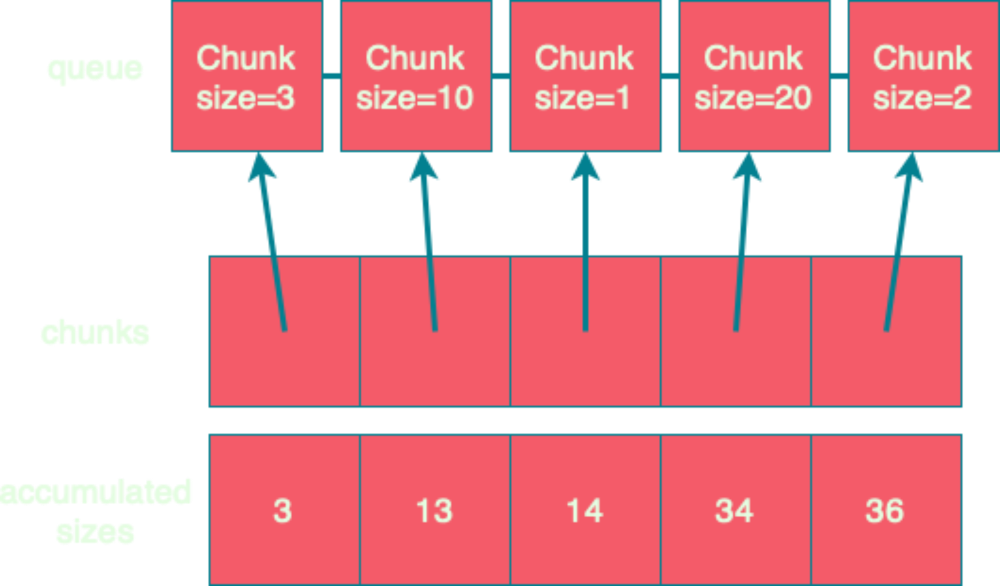

= fs2.Chunk
:source-highlighter: highlightjs
:highlightjs-languages: scala
:highlightjs-theme: css/solarized-dark.css
:revealjs_theme: moon
:revealjs_hash: true
:customcss: css/presentation.css
:icons: font

image::images/fs2-logo.png[]

[transition=fade-out]
== A chunk is...

* an _immutable_, _strict_, _finite_ sequence of values
* that supports _efficient index-based random access_ of elements

[transition=fade-in]
=== A +++<del>+++chunk+++</del>+++ Vector is...

* an _immutable_, _strict_, _finite_ sequence of values
* that supports _efficient index-based random access_ of elements

=== Why not use Vector?

[source,scala]
----
trait Socket[F[_]]:
  def reads: Stream[F, Byte]

trait Files[F[_]]:
  def readAll(path: Path): Stream[F, Byte]
----

* Streams move chunks
* If streams passed around vectors, we'd need to copy the underlying buffers.

=== Why not use Vector?

|===
|Size|0|1|10|100|1K|10K

|2.12 Vector|56|216|216|792|4824|46728
|2.13 Vector|40|56|88|536|4696|46528
|Array|16|24|32|120|1016|10016
|Chunk|16|32|64|152|1048|10048
|===

[.notes]
* `Vector[Byte]`, `Array[Byte]`, and `Chunk[Byte]`
* Object size reported by Spark's `SizeEstimator.estimate`

== A chunk is...

* an _immutable_, _strict_, _finite_ sequence of values
* that supports _efficient index-based random access_ of elements
* that's _memory efficient_ for all sizes
* that _avoids unnecessary copying_

== A chunk is finite

[source,scala]
----
trait Chunk[+A]:
  def size: Int
----

== A chunk has efficient random access

[source,scala]
----
trait Chunk[+A]:
  def size: Int
  def apply(idx: Int): A
----

== A chunk is memory efficient

[source,scala]
----
object Chunk:
  val empty: Chunk[Nothing] = new:
    def size = 0
    def apply(idx: Int) = throw new IndexOutOfBoundsException

  def singleton[A](a: A): Chunk[A] = new:
    def size = 1
    def apply(idx: Int) = idx match
      case 0 => a
      case _ => throw new IndexOutOfBoundsException

  def array[A](arr: Array[A]): Chunk[A] = new:   <1>
    def size = arr.length
    def apply(idx: Int) = arr(idx)
----
<1> Not making a defensive copy for performance reasons

== A chunk avoids copying

[source,scala]
----
object Chunk:
  def indexedSeq[A](as: IndexedSeq[A]): Chunk[A] = new:
    def size = as.size
    def apply(idx: Int) = as(idx)

  import java.nio.ByteBuffer

  def byteBuffer(buffer: ByteBuffer): Chunk[Byte] = new:  <1>
    private val b = buffer.duplicate().asReadOnlyBuffer
    def size = b.remaining
    def apply(idx: Int) = b.get(b.position + idx)
----
<1> Not making a defensive copy for performance reasons

=== A chunk avoids copying

[source,scala]
----
val huge: Chunk[Byte] = ???
val pfx: Chunk[Byte] = huge.take(10)
val sfx: Chunk[Byte] = huge.drop(10)
----

=== A chunk avoids copying

[source,scala]
----
val huge: Chunk[Byte] = ???
val (prefix, suffix) = huge.splitAt(10)
process(prefix) >> saveForLater(suffix)
----

=== A chunk avoids copying

[source,scala]
----
case class ArraySlice[+A](values: Array[A],
                          offset: Int,
                          size: Int) extends Chunk[A]:
  require(offset >= 0 && ...)

  def apply(idx: Int) = 
    if idx < 0 || idx >= size then throw new IndexOutOfBoundsException()
    else values(offset + idx)

  def splitAt(idx: Int) =                              <1>
    if idx <= 0 then Chunk.empty -> this
    else if idx >= size then this -> Chunk.empty
    else ArraySlice(values, offset, idx) ->
           ArraySlice(values, offset + idx, length - idx)
----
<1> Zero copy `splitAt` at cost of non-strictness and potentially increased memory usage

== Combinators: foreach

[source,scala]
----
trait Chunk[+A]:
  def size: Int
  def apply(idx: Int): A

  def foreach(f: A => Unit): Unit =
    var i = 0
    while (i < size)
      f(apply(i))
      i += 1
----

== Combinators: foreachWithIndex

[source,scala]
----
trait Chunk[+A]:
  def size: Int
  def apply(idx: Int): A

  def foreachWithIndex(f: (A, Int) => Unit): Unit =
    var i = 0
    while (i < size)
      f(apply(i), i)
      i += 1
----

== Combinators: map

[source,scala]
----
trait Chunk[+A]:
  def map[B](f: A => B): Chunk[B] =
    ???
----

=== Combinators: map

[source,scala]
----
trait Chunk[+A]:
  def map[B](f: A => B): Chunk[B] =
    var arr = new Array[B](size)                <1>
    foreachWithIndex((a, i) => arr(i) = f(a))
    Chunk.array(arr)
----
<1> `cannot find class tag for element type B`

=== Combinators: mapCompact

[source,scala]
----
trait Chunk[+A]:
  def mapCompact[B: ClassTag](f: A => B): Chunk[B] =   <1>
    var arr = new Array[B](size)
    foreachWithIndex((a, i) => arr(i) = f(a))
    Chunk.array(arr)
----
<1> Add a `ClassTag` constraint

=== Combinators: mapCompact

`mapCompact` doesn't exist on `Chunk` - why?

* `Function1` is not specialized for all primitives
+
[source,scala]
----
trait Function1[
  @specialized(Int, Long, Double) -T1,
  @specialized(Int, Long, Float, Double, Boolean, Unit) +R]
----
+
* `ClassTag` constraints virally propagate
* Forces folks to chose between `map` and `mapConcat`
* Doesn't scale to other operations

=== Combinators: map

[source,scala]
----
trait Chunk[+A]:
  def map[B](f: A => B): Chunk[B] =
    var arr = new Array[Any](size)               <1>
    foreachWithIndex((a, i) => arr(i) = f(a))
    Chunk.array(arr).asInstanceOf[Chunk[B]]      <2>
----
<1> Create an an `Array[Any]` instead
<2> Unsound! Must ensure the underlying array is never accessed as an `Array[B]`

=== Combinators: compact

[source,scala]
----
trait Chunk[+A]:
  def toArray[A2 >: A: ClassTag]: Array[A] =
    val arr = new Array[A2](size)
    foreachWithIndex((a, i) => arr(i) = a)
    arr

  def compact[A2 >: A: ClassTag]: Chunk[A] =
    Chunk.array(toArray)
----

== Combinators: filter

[source,scala]
----
trait Chunk[+A]:
  def filter(p: A => Boolean): Chunk[A] =
    ???
----

=== Combinators: filter

[source,scala]
----
trait Chunk[+A]:
  def filter(p: A => Boolean): Chunk[A] =
    val b = collection.mutable.ArrayBuilder.make[Any]  <1> <2>
    b.sizeHint(size)
    foreach(a => if p(a) then b += a)
    Chunk.array(b.result()).asInstanceOf[Chunk[A]]
----
<1> Use `ArrayBuilder` instead of `Array` since we don't know final size
<2> Use `Any` like in `map`, resulting in boxing of primitives

== A chunk is...

* an _immutable_, _strict_, _finite_ sequence of values
* that supports _efficient index-based random access_ of elements
* that's _memory efficient_ for all sizes
* that _avoids unnecessary copying_

[transition=slide-in fade-out,transition-speed=fast]
== Avoiding Copying

[source,scala,linenumbers]
----
val huge: Chunk[Byte] = ???
val crlf: Chunk[Byte] = Chunk.array("\r\n".getBytes)

val discouraged = Stream.chunk(huge ++ crlf)
val encouraged = Stream.chunk(huge) ++ Stream.chunk(crlf)
----
How can we discourage copying?

[transition=fade,transition-speed=fast]
=== Avoiding Copying

[source,scala,highlight=4]
----
val huge: Chunk[Byte] = ???
val crlf: Chunk[Byte] = Chunk.array("\r\n".getBytes)

val discouraged = Stream.chunk(Chunk.concat(List(huge, crlf)))
val encouraged = Stream.chunk(huge) ++ Stream.chunk(crlf)
----
Make it inconvenient!

=== concat

[source,scala,linenumbers]
----
object Chunk:
  def concat[A: ClassTag](chunks: Seq[Chunk[A]]): Chunk[A] =
    val totalSize = chunks.foldMap(_.size)
    val arr = new Array[A](totalSize)
    var offset = 0
    chunks.foreach { c =>
      if !c.isEmpty then
        c.copyToArray(arr, offset)
        offset += c.size
    }
    Chunk.array(arr)
----

== unconsN

[source,scala,linenumbers,highlight=1..4|5-9|10|11|12-18]
----
def unconsN[F[_], O](
  s: Stream[F, O],
  n: Int
): Pull[F, Nothing, Option[(Chunk[O], Stream[F, O])]] =
  def go(
    acc: Queue[Chunk[O]], 
    s: Stream[F, O], 
    n: Int
  ): Pull[F, Nothing, Option[(Chunk[O], Stream[F, O])]] =
    s.pull.uncons.flatMap {
      case None => Pull.pure(Chunk.concat(acc))
      case Some((hd, tl)) =>
        if hd.size < n then
          go(acc :+ hd, tl, n - hd.size)
        else
          val (pfx, sfx) = hd.splitAt(n)
          val out = Chunk.concat(acc :+ pfx)
          Pull.pure((out, tl.cons(sfx))
    }
  go(Queue.empty, s, n)
----

=== unconsN

[%step]
* Problem: `concat` requires a `ClassTag[O]`
* Option 1: add `ClassTag` constraint
+
[source,scala]
----
def unconsN[F[_], O: ClassTag](...)
----
+
* Option 2: change return type to `Queue[Chunk[O]]`
+
[source,scala]
----
def unconsN[F[_], O](
  ...
): Pull[F, Nothing, Option[(Queue[Chunk[O]], Stream[F, O])]]
----
+
* Option 3: remove `ClassTag` constraint from `concat`

== concat tagless

[source,scala,highlight=4]
----
object Chunk:
  def concat[A](chunks: Seq[Chunk[A]]): Chunk[A] =
    val totalSize = chunks.foldMap(_.size)
    val arr = new Array[Any](totalSize)
    var offset = 0
    chunks.foreach { c =>
      if !c.isEmpty then
        c.copyToArray(arr, offset)
        offset += c.size
    }
    Chunk.array(arr).asInstanceOf[Chunk[A]]
----

Downside: primitives get boxed. Can we fix?

=== concat too clever

[source,scala,highlight=1-|3-6|10]
----
object Chunk:
  def concat[A](chunks: Seq[Chunk[A]]): Chunk[A] =
    if chunks.forall(containsOnly[Byte]) 
    then concatTagged[Byte](
           chunks.asInstanceOf[Seq[Chunk[Byte]]]
         ).asInstanceOf[Chunk[A]]
    else if ...
    else concatUntagged(chunks)

  def containsOnly[A](c: Chunk[A])(using ct: ClassTag[A]): Boolean =
    c.knownElementType == ct || c.forall(_.isInstanceOf[A])

  def concatUntagged[A](chunks: Seq[Chunk[A]]): Chunk[A] =
    /* store elements in an Array[Any] */
  def concatTagged[A: ClassTag](chunks: Seq[Chunk[A]]): Chunk[A] = ???
    /* store elements in an Array[A] */
----

=== concat too clever

[source,scala]
----
scalajs> 1.isInstanceOf[Byte]
res0: Boolean = true
----

Reflection is never safe.footnote:[I made up this Scala.js REPL, but the result is real!]

== unconsN

* Problem: `concat` requires a `ClassTag[A]`
* Option 4: make `Queue[Chunk[A]]` a subtype of `Chunk[A]`

=== Chunk.Queue

[source,scala,linenumbers,highlight=1-7|9-15|17-24]
----
import scala.collection.immutable.Queue as SQueue

object Chunk:
  class Queue[+A] private (
    val chunks: SQueue[Chunk[A]], 
    val size: Int
  ) extends Chunk[A]:

    def +:[A2 >: A](c: Chunk[A2]): Queue[A2] =
      if c.isEmpty then this
      else new Queue(c +: chunks, c.size + size)

    def :+[A2 >: A](c: Chunk[A2]): Queue[A2] =
      if c.isEmpty then this
      else new Queue(chunks :+ c, size + c.size)

    def apply(i: Int): O =
      if i < 0 || i >= size
      then throw new IndexOutOfBoundsException()
      def go(chunks: SQueue[Chunk[O]], offset: Int): O =
        val head = chunks.head
        if offset < head.size then head(offset)
        else go(chunks.tail, offset - head.size)
      go(chunks, i)
----

=== Chunk.Queue#++

[source,scala]
----
trait Chunk[+A]:
  def ++[A2 >: A](that: Chunk[A2]): Chunk[A2] =
    if isEmpty then that
    else
      that match
        case that if that.isEmpty  => this
        case that: Chunk.Queue[A2] => this +: that
        case that                  => Chunk.Queue(this, that)
----

=== unconsN Redux

[source,scala,linenumbers,highlight=6|11|14|17]
----
def unconsN[F[_], O](
  s: Stream[F, O],
  n: Int
): Pull[F, Nothing, Option[(Chunk[O], Stream[F, O])]] =
  def go(
    acc: Chunk[O], 
    s: Stream[F, O], 
    n: Int
  ): Pull[F, Nothing, Option[(Chunk[O], Stream[F, O])]] =
    s.pull.uncons.flatMap {
      case None => Pull.pure(acc)
      case Some((hd, tl)) =>
        if hd.size < n then
          go(acc ++ hd, tl, n - hd.size)
        else
          val (pfx, sfx) = hd.splitAt(n)
          val out = acc ++ pfx
          Pull.pure((out, tl.cons(sfx))
    }
  go(Queue.empty, s, n)
----

== Chunk.Queue Runtime

[%step]
.What's asymptotic runtime of `Chunk.Queue#apply`?
* If number of constituent chunks is much smaller than total size, then O(1)
* As number of constituent chunks approaches total size, runtime approaches O(n)

=== Chunk.Queue

.What's asymptotic runtime of `foreach`?
[source,scala]
----
trait Chunk[+A]:
  def foreach(f: A => Unit): Unit =
    var i = 0
    while (i < size)
      f(apply(i))
      i += 1
----

[%step]
* O(n) when number of constituent chunks much smaller than total size
* O(n^2^) when number of constituent chunks approaches total size

=== Restoring foreach linearity
[source,scala,linenumbers,highlight=7-8|10-17]
----
object Chunk:
  class Queue[+A] private (
    val chunks: SQueue[Chunk[A]], 
    val size: Int
  ) extends Chunk[A]:

    def foreach(f: A => Unit): Unit =
      chunks.foreach(_.foreach(f))

    def foreachWithIndex(f: (A, Int) => Unit): Unit =
      var i = 0
      chunks.foreach { chunk =>
        chunk.foreach { a => 
          f(a, i)
          i += 1
        }
      }
----

== What about lookup by index?

=== What about lookup by index?

* Compute an array of accumulated sizes
** sizes(0) = size of first chunk
** sizes(1) = sum of sizes of first and second chunk
* To lookup element at index i:
** Binary search sizes to find smallest entry greater than i
** The chunk at the resulting index contains the desired element
* (Suggested by fs2 maintainer Diego E. Alonso Blas)

[.columns]
=== What about lookup by index?

[.column]

[.column]
[source,scala]
----
apply(20)
> find smallest acc > 20
> returns idx = 3, acc = 34 
> return chunks(idx)(20 - 14)
----

=== What about lookup by index?

[source,scala,highlight=2-13|15-45]
----
class Queue[+A](...):
  private[this] lazy val accumulatedSizes: (Array[Int], Array[Chunk[O]]) =
    val sizes = new Array[Int](chunks.size)
    val arr = new Array[Chunk[A]](chunks.size)
    var accSize = 0
    var i = 0
    chunks.foreach { c =>
      accSize += c.size
      sizes(i) = accSize
      arr(i) = c
      i += 1
    }
    (sizes, arr)

  def apply(i: Int): A =
    if i < 0 || i >= size
    then throw new IndexOutOfBoundsException()
    if i == 0 then chunks.head(0)
    else if i == size - 1 then chunks.last.last.get
    else
      val (sizes, chunks) = accumulatedSizes
      val j = java.util.Arrays.binarySearch(sizes, i)
      if j >= 0 then
        chunks(j + 1)(0)
      else
        val k = -(j + 1)
        val accSizeBefore = if k == 0 then 0 
                            else sizes(k - 1)
        chunks(k)(i - accSizeBefore)
----

=== Runtimes

* For a `Chunk.Queue` with n elements and m constituent chunks:
** first call to `apply` is `O(m log m)`
** subsequent calls are `O(log m)`
** Worst case `m == n`

== Wrap-up

=== A chunk is...

* an _immutable_, **_mostly_** _strict_, _finite_ sequence of values
* that supports **_mostly_** _efficient index-based random access_ of elements
* that's _memory efficient_ for all sizes
* that _avoids unnecessary copying_

[%notitle]
=== Design

Design is a series of logical decisions.

[%notitle]
=== Design

[.line-through]
Design is a series of logical decisions.

Design is an iterative process of failures and successes, informed by experiments and analysis.

https://github.com/typelevel/fs2/pull/1159[#1159]
https://github.com/typelevel/fs2/pull/1202[#1202]
https://github.com/typelevel/fs2/pull/1275[#1275]
https://github.com/typelevel/fs2/pull/1712[#1712]
https://github.com/typelevel/fs2/pull/1715[#1715]
https://github.com/typelevel/fs2/pull/1745[#1745]
https://github.com/typelevel/fs2/pull/1746[#1746]
https://github.com/typelevel/fs2/pull/1856[#1856]
https://github.com/typelevel/fs2/pull/2180[#2180]
https://github.com/typelevel/fs2/pull/2181[#2181]
https://github.com/typelevel/fs2/pull/2380[#2380]
https://github.com/typelevel/fs2/pull/2381[#2381]
https://github.com/typelevel/fs2/pull/2630[#2630]
https://github.com/typelevel/fs2/pull/2631[#2631]
https://github.com/typelevel/fs2/pull/2679[#2679]
https://github.com/typelevel/fs2/pull/2680[#2680]
https://github.com/typelevel/fs2/pull/2720[#2720]

[.columns]
=== Summary

[.column]
* Identify important properties
* Constraints provide tension
* Be open to relaxing constraints
* Benchmark common usage patterns
* Iterate

[.column]
image::images/fs2-logo.png[]